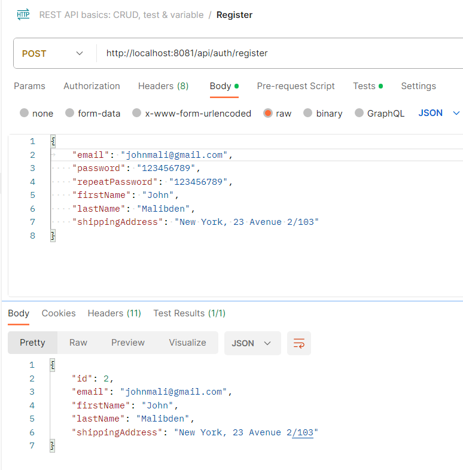
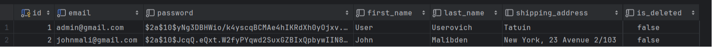
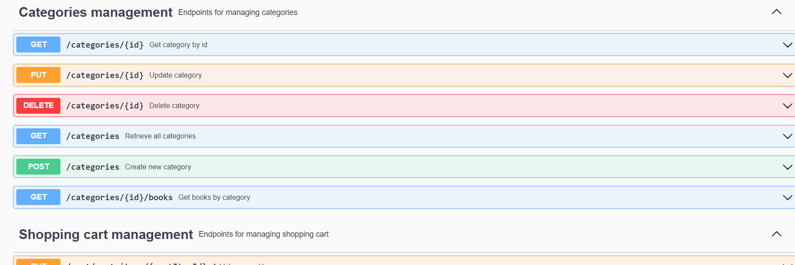
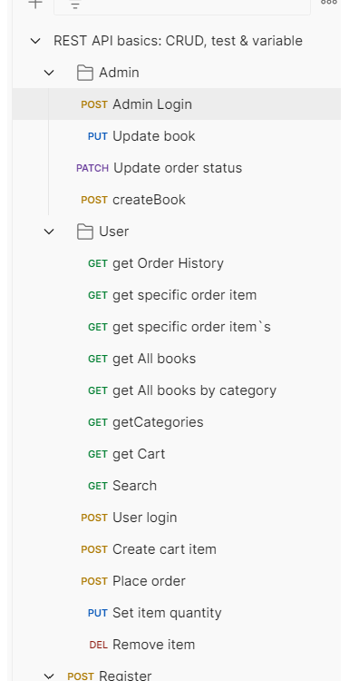
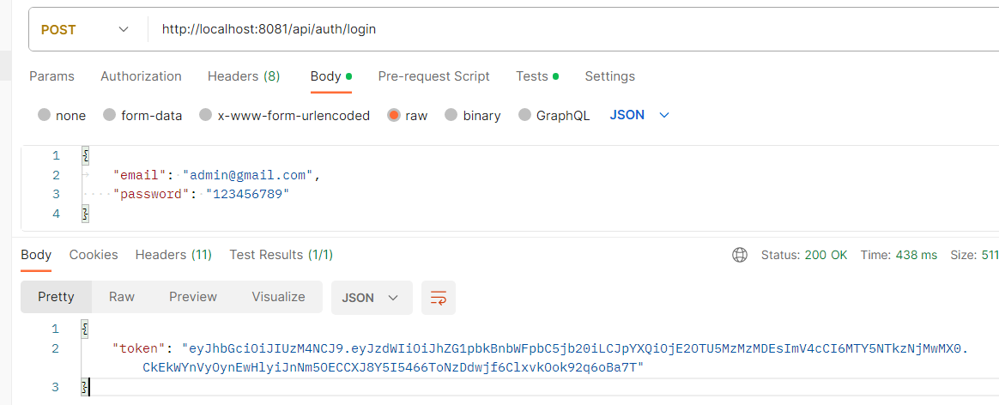
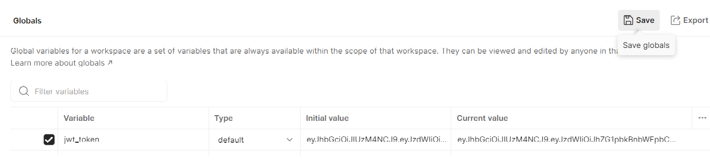

# Bookhero
<span style="font-size: 24px; color: #30558a">Bookstore Java Application</span>

<span style="display: inline-block; border: 5px solid #30558a; border-radius: 25px; padding: 7px;">

</span>


## Introduction

Welcome to the Bookstore Java Application!\
This project was inspired by the need to efficiently manage an electronic bookshop,
providing users with the ability to browse, purchase, and manage books seamlessly. \
Whether you're a book enthusiast, a developer looking for inspiration,
or a team member interested in understanding this project,
this README will guide you through the key aspects of this application.

Link to Loom video about this project: [link](https://bit.ly/48B6FIo)

## Table of Contents

- [Technologies and Tools](#technologies-and-tools)
- [Functionalities](#functionalities)
- [Project Structure](#project-structure)
- [Getting Started](#getting-started)
- [Challenges Faced](#challenges-faced)
- [Swagger Documentation](#swagger-documentation)
- [Postman Collection](#postman-collection)
- [Contributing](#contributing)

## Technologies and Tools

This application is built using the following technologies and tools:

- **Spring Boot**: For rapid application development and configuration management.
- **Spring Security**: Ensuring the security and authentication of users.
- **Spring Data JPA**: Simplifying database operations.
- **Swagger**: Providing API documentation for developers.
- **Maven**: Dependency management and project building.
- **IntelliJ IDEA**: Recommended development environment.

## Functionalities

This application is divided into several layers depending on the REST architecture.\
But the best representation of the functionality can be obtained from the controllers mentioned below:

- **AuthenticationController**: Handles user authentication and registration.\
  <span style="display: inline-block; border: 5px solid #518a51; border-radius: 25px; padding: 7px;">
  
  </span>\
  <span style="display: inline-block; border: 5px solid #518a51; border-radius: 25px; padding: 7px;">
  
  </span>
- **BookController**: Manages books, including creation, retrieval, updating, and deletion (CRUD).
- **CategoryController**: Controls book categories and their management.
- **OrderController**: Manages user orders and their status updates.
- **ShoppingCartController**: Deals with user shopping carts and cart items.

## Project Structure

The project is structured as follows:

- `.github`: Configuration files for GitHub.
- `.idea`: Configuration for IntelliJ IDEA.
- `.mvn`: Maven configuration files.
- `src`: Main project directory containing Java source code.
    - `bookstore`: Root package for the application.
        - `config`: Configuration classes for the application.
        - `controller`: Controllers for various functionalities. Application entry point.
        - `dto`: Data Transfer Objects used for requests and responses.
          - `book`: DTOs related to books.
          - `exception`: Exceptions DTOs.
          - `item`: Item-related classes.
          - `order`: Classes related to orders.
          - `orderitem`: Order item classes.
          - `user`: User-related classes.
        - `enums`: Enumerations used in the application: order status and user`s roles.
        - `exception`: Custom exceptions and exception handling.
        - `mapper`: Mapper classes for converting between entities and DTOs.
        - `model`: Entity classes representing database tables.
        - `repository`: Data repositories.
        - `security`: Security-related classes and authentication filter logic.
        - `service`: Service implementations and interfaces.
    - `validation`: Validation class FieldValueMatch annotation logic.
- `resources`: Configuration and resource files.
- `changelog`: Liquibase database changelog scripts.
- `test`: Integration tests classes.
- `db-scripts`: SQL scripts for tests setup.
- `application.properties`: Application properties for tests.

## Getting started

To simplify deployment and management of this application, using Docker is recommended.\
Docker allows you to build, package, and run this application in containers, making the deployment process straightforward and repeatable.

### Installing Docker

If Docker is not already installed on your computer, you can download it from the [official Docker website](https://www.docker.com/get-started).

### Deploying the Application with Docker

To deploy this application with Docker, follow these steps:

1. Build the Docker image using the provided Dockerfile in the project's root directory:

   ```bash
   docker compose build

2. Run the container with the built image:

    docker compose up

Here, -p allows you to specify the port on which your application will be available.

3. Your application is now accessible at http://localhost:8081.

Additional Docker Commands
To view a list of active containers, use:

    docker ps
To stop a container, use:

    docker stop bookstore
After starting the application, you can access the API documentation and endpoints at 
[Swagger Documentation](http://localhost:8081/api/swagger-ui/index.html).\
Or [Postman](https://github.com/CodeWebWeaver/bookhero_postman_colletion).

## Challenges Faced

During the development of this project, encountered several challenges,
including a circular dependency issue within the service layer.\
After identifying the source of the problem, 
code been refactored to utilize repositories instead of services within the service layer.\
While there was an option to resolve this by autowiring through setters,
but using repositories improved the overall design and maintenance.

## Swagger Documentation

API documentation is available via Swagger.\
You can access it by clicking [here](http://localhost:8081/api/swagger-ui/index.html).\
Swagger provides detailed information about API endpoints, request parameters, and responses, making it easy for developers to explore and understand the API.



## Postman Collection

For an even easier understanding of API endpoints, you can explore our Postman collection.\
Import this collection to postman and explore different endpoints:
[Link to postman collection](https://github.com/CodeWebWeaver/bookhero_postman_colletion).\
(use http://localhost:8081 port for access to docker)


<span style="display: inline-block; border: 5px solid #30558a; border-radius: 25px; padding: 7px;">

</span>

Login after registration:\
<span style="display: inline-block; border: 5px solid #30558a; border-radius: 25px; padding: 7px;">

</span>


Set to jwt token to your environment:

<span style="display: inline-block; border: 5px solid #30558a; border-radius: 25px; padding: 7px;">

</span>

Test different operations!


## Contributing

If you'd like to contribute to this project, I always ready for conversation 
on [GitHub](https://github.com/CodeWebWeaver)

Thank you for your interest in Bookstore Java Application!
